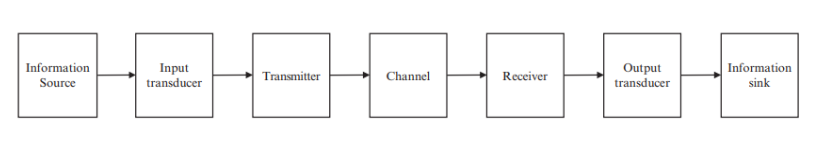
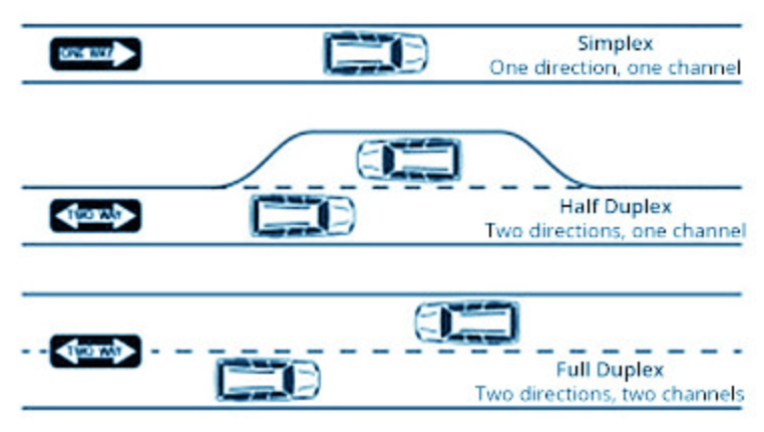

# Características de um Sistema de Comunicação Digital

**Figura 1** - Diagrama de blocos de um Sistema de Comunicação Digital

## Tipos de Ligação 

Define a topologia de ligação dos  intervenientes no processo de comunicação.

- Ponto a Ponto
- Ponto a Multiponto
- Multiponto a Multiponto

## Direção da Transmissão

- **Simplex**: Transmissão num só sentido. O receptor não responde pelo mesmo canal.
    - Exemplo: Televisão, rádio,...
- **Duplex**: Transmissão nos dois sentidos no mesmo canal. Os dois equipamentos possuem emissor e receptor.
    - **Half-Duplex**: A largura de banda é totalmente ocupada por um sentido de cada vez.
        - Exemplo: Walkie-Talkie, rádio,...
    - **Full-Duplex**: A largura de banda é repartida de forma a que a comunicação seja possível em simultânea nos dos sentidos.
        - Exemplo: Telefone fixo, telemóvel,...

**Figura 2** - Analogia sobre a direção da transmissão

## Tipos de sinal transmitido

- **Analógico**: Envio de sinal analógico, o qual deve ser reproduzido no receptor
    - Exemplo: sinal áudio produzido por um microfone, rádio,...
- **Digital**: Transferência de bits entre equipamentos,...
    - Exemplo: Ligação entre computadores, redes locais de computadores, interface USB,...

## Banda de frequência

- **Banda Base**: 
    - Uso de códigos de linha (ondas quadradas) colocados diretamente no meio de transmissão, sem translação na frequência
    - O meio de transmissão admite componentes de frequência em torno de 0Hz.
    - Os meios de transmissão são tipicamente cabos metálicos (ou fibra).
    - Não é possível transmitir em banda base através do meio wireless (propagação no espaço livre).
    - Exemplos:
        1. Intercomunicador de Áudio.
        2. Sistemas CCTV.
        3. Ligação entre computadores e dispositivos.
        4. USB, CAN.
        5. Redes locais.

- **Banda Canal**:
    - Uso de sinusóides para posicionar o espetro em determinadas frequências. Este processo é designado por modulação.
    - Aproveitamento eficiente da largura de banda do meio de transmissão.
    - Escolha da frequeência e das bandas de frequências a utilizar. Os meios de transmissão são cabos, fibra ou ar.
    - Exemplos: 
        1. Transmissão wireless (Wi-Fi, Wi-Max,...)
        2. Sistemas de comunicações móveis

