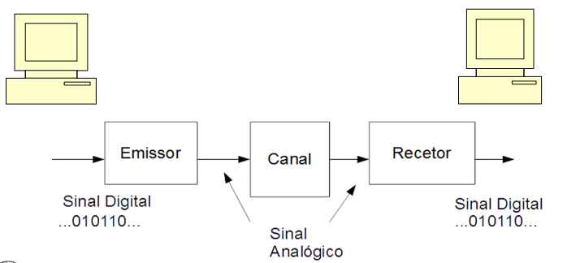
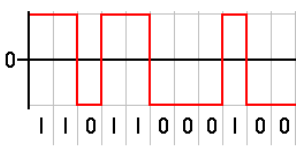
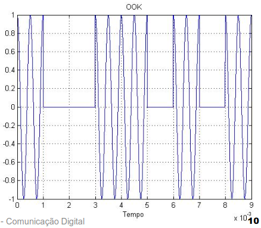
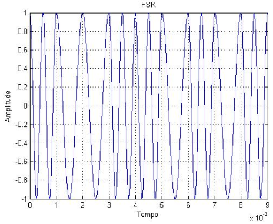
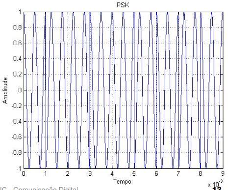

# 1. Sistemas de Comunicação Digital

1. Fonte de informação (Produz)
2. Sistemas emissor, canal e receptor (Transporta) 
3. Destinatário da informação (Recebe)

A informação a transmitir pode ser analógica ou digital.

- **Fonte analógica**: Produz um sinal analógico/contínuo
- **Fonte digital**: Produz uma sequência de dígitos binários

## Sinais e Sistemas

- **Emissor**: Produz o sinal a ser transmitido
- **Canal**: Meio de transmissão através do qual o sinal vai ser transmitido 

**Figura 1** - Sistema de Comunicação Digital

### Exemplos de codificação de Sinais

- **Códigos de linha**: Exemplos de codificação binária 

- **OOK- On-Off Keying**: A mensagem é transmitida através da mudança da amplitude do sinal

- **FSK- Frequency Shift Keying**: A mensagem é transmitida através da mudança da frequência do sinal

- **PSK- Phase Shift Keying**: A mensagem é transmitida através da mudança da fase do sinal

## Indicadores sobre o sistema de comunicação digital

- **Tb, Tempo de bit**: Corresponde ao tempo que o sinal correspondente a um bit demora a ser transmitido
- **Rb, Débito binário**: Taxa de bits por segundo que o SCD transfere (1/Tb)
    - Rb = 1/Tb, ou seja, é o inverso do tempo de
    - É expresso em bit/s 
- **BER - Bit Error Rate**: Taxa de erro de bit ou relação de erro de bit
    - BER = nº de bits errados / nº de bits transmitidos
    - Representa uma estimativa da probabilidade de erro por bit, do sistema
    - São valores típicos BER = 10^-4, 10^-5, 10^-6... consoante o tipo de sinal transmitido pelo SCD
- **Terr**: Tempo médio esperado entre erros consecutivos
    - Terr = Tb / BER = 1 / Rb * BER
- **Tx**: Duração de transmissão de um conteúdo binário com #bits
    - Tx = #bits / Rb = #bits * Tb

