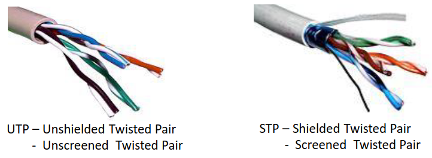
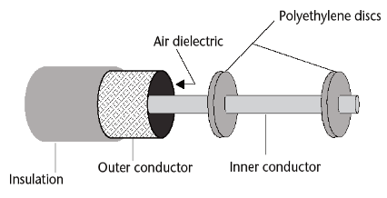
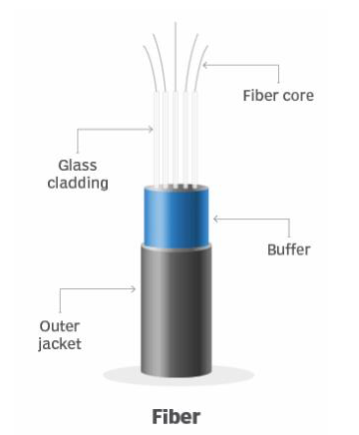
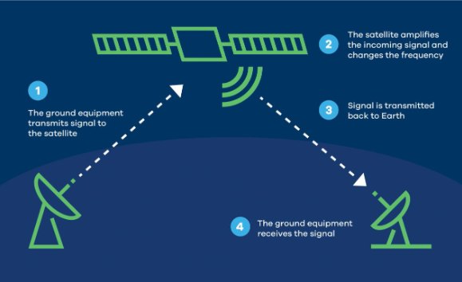

# Meios de Transmissão de um SDC

## Table of Contents 

- [Meios de Transmissão de um SDC](#meios-de-transmissão-de-um-sdc)
  - [Table of Contents](#table-of-contents)
      - [Pares Trançados UTP e STP](#pares-trançados-utp-e-stp)
      - [Cabo Coaxial](#cabo-coaxial)
      - [Fibra Ótica](#fibra-ótica)
        - [Características físicas da fibra ótica](#características-físicas-da-fibra-ótica)
        - [Características gerais da fibra ótica](#características-gerais-da-fibra-ótica)
        - [Aplicações da fibra ótica:](#aplicações-da-fibra-ótica)
      - [Canal Rádio](#canal-rádio)
        - [Características gerais do canal rádio](#características-gerais-do-canal-rádio)
        - [Aplicações do canal rádio](#aplicações-do-canal-rádio)

1. **Par entrançado de cobre** (ex: Telefone)
2. **Cabo coaxial** (ex: TV por cabo)
3. **Espaço livre** (ex: telemóveis)
4. **Fibra ótica** (ex: redes de alta velocidade)

### Pares Trançados UTP e STP

O par é formado por dois condutores elétricos enrolados em espiral. Através do efeito de cancelamento, reduzem o efeito das interferências eletromagnéticas. Um cabo contém vários pares.

- **UTP (Unshielded Twisted Pair)**: Não tem proteção contra interferências eletromagnéticas
- **STP (Shielded Twisted Pair)**: Tem proteção contra interferências eletromagnéticas

**O desempenho dos pares trançados piora com o aumento da frequência! Ou seja, a atenuação aumenta à medida que a frequência aumenta.**

- A velocidade de propagação é de cerca de 175000 km/s, que corresponde a um atraso de propagação de 5,7 µs/km.
- Uma das suas aplicações é o canal telefónico, construído de modo a transmitir sinais de fala entre dois pontos.
- Este canal tem um ganho praticamente constante entre os 300 e os 3,3 kHz, capaz de transmitir fala perceptível.
- Cabos blindados podem ir até larguras de banda de 2 GHz
    - Débitos binários de 40 Gbit/s
    - Distâncias de 30 m
- Existe uma relação entre
    - Frequência de operação (largura de banda)
    - Ritmo de transmissão, Rb.

**Figura 1** - Pares entrançados

### Cabo Coaxial 

Um cabo coaxial possui um condutor central isolado da malha exterior (o isolamento é feito através de ar e/ou de plástico). A malha protege o condutor através relativamente a interferências eletromagnéticas. Também em cobre, atua como um segundo condutor. Um segundo isolante protege todo o cabo.

Existem **três** tipos standard de cabo coaxial em função do diâmetro do condutor interior:
    - **Normal Core**
    - **Small Core**
    - **Micro Core**

A atenuação tal como nos pares trançados aumenta com a frequência. Destes três tipos de cabo, o que têm maior atenuação em relação à frequência é o Micro e o que tem menos é o Normal Core.

Possui largura de banda **superior** e melhor desempenho em relação aos pares trançados.

- A largura deste meio de transmissão pode chegar aos 10 GHz.
- A velocidade de propagação é de cerca de 250000 km/s, que corresponde a um atraso de propagação de 4 µs/km.
- Algumas das utilizações são:
    - Ligação entre equipamentos numa rede local.
    - Transmissão de sinais de TV analógicos que podem coexistir com sinais digitais no fornecimento de televisão por cabo.

**Figura 2** - Cabo Coaxial

### Fibra Ótica

Este cabo é um **condutor de luz**, construído a partir de **vidro** ou **plástico**. Os sinais são transmitidos na forma de **luz**, através de LED (Light Emitting Diode) ou de ILD (Injection Laser Diode). A luz é depois convertida num sinal elétrico.

#### Características físicas da fibra ótica

- Núcleo central cilíndrico e transparente de vidro puro.
- O núcleo é envolvido por uma camada de material com menor índice de refração.
- A casca ainda é envolvida por material plástico para proteção mecânica.

#### Características gerais da fibra ótica

- Transporta sinais de luz de um ponto para o outro.
- Elevada largura de banda aliada a uma pequena atuação.
- A largura de banda depende da distância percorrida (ao contrários dos outros meios de transmissão) pois esta aumenta a dispersão dos pulsos de luz.
- É ainda **imune a interferências eletromagnéticas** tendo um tamanho e peso pequenos.
- A velocidade da luz na fibra ótica é de cerca de 200000 km/s, sendo o atraso de propagação de cerca de 5 µs/km.
- Um cabo ótico contém várias fibras.
- As fibras podem ser:
    - **Monomodo**: Diâmetro do núcleo menor, ou seja, há menos dispersão, o que aumenta a velocidade de transmissão.
    - **Multimodo**: Diâmetro do núcleo maior, ou seja, há mais dispersão, o que diminui a velocidade de transmissão.
- Menor atuação do que o cabo coaxial.

#### Aplicações da fibra ótica:

- Interligação de redes
- MAN - Metropolitan Area Network
- Ligação de assinante (fiber to home)

**Figura 3** - Fibra Ótica

### Canal Rádio

Os canais de comunicação que empregam a transmissão rádio utilizam o **espaço livre** como **meio de propagação** de **ondas eletromagnéticas**.

#### Características gerais do canal rádio

- Têm uma característica passa-banda:   
    - Transmissão de sinais modulados (áudio, televisão).
    - Mobilidade à rede telefónica e às redes de computadores.
- Pode sofrer de receção multipercurso devido a reflexões em obstáculos.
- O atraso de propagação num canal rádio é praticamente igual ao da luz, 3,33 µs/km.
- O atraso de propagação do sinal para percorrer duas vezes (ida e volta) a distância da Terra ao satélite é de 0,24s. 

#### Aplicações do canal rádio

- Transmissão por satélite 
    - Servem vastas áreas para difundir sinais de televisão. 
    - Permitem também efetuar ligações intercontinentais de voz ou televisão. 
    - São também utilizados no fornecimento de serviços integrados.

**Figura 4** - Satélite
